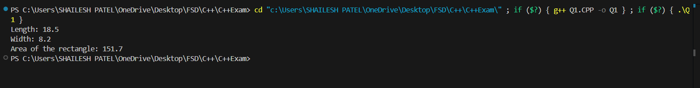
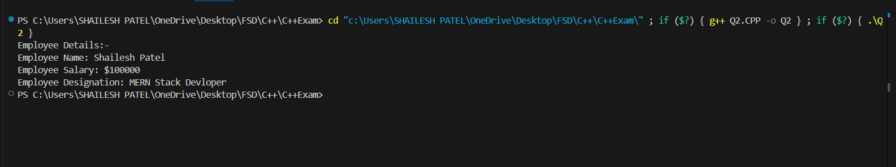
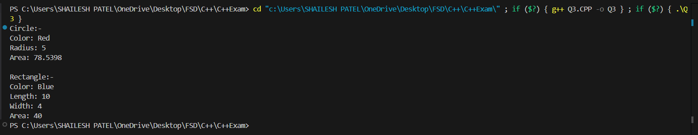
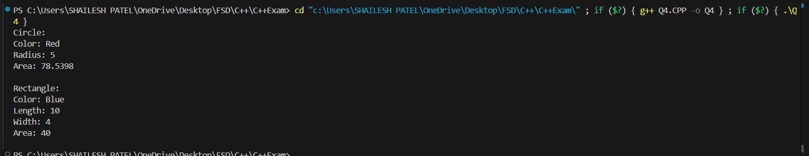
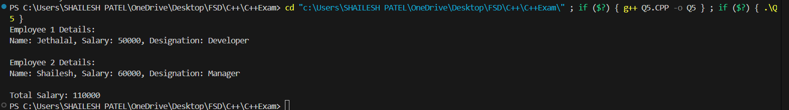
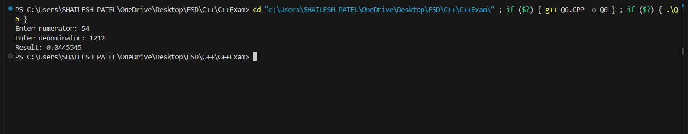
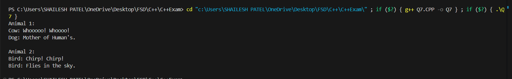

<h1 align="center">Exam_C++</h1>
 

<h1 align="center">Q1</h1>
 

 

<h1 align="center">Q2</h1>
 

 

<h1 align="center">Q3</h1>
 

 

<h1 align="center">Q4</h1>
 

 

<h1 align="center">Q5</h1>
 

 

<h1 align="center">Q6</h1>
 

 

<h1 align="center">Q7</h1>
 

 

